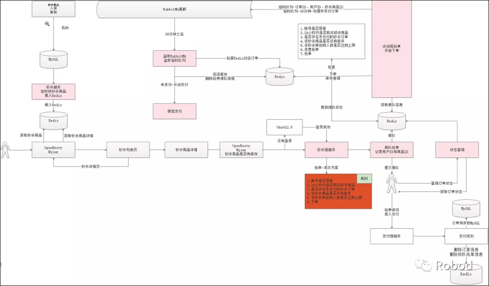

1.秒杀业务流程分析  
20201031  

1  
秒杀List (从Redis中获取数据，有定时任务往Redis中添加)  
->秒杀详情页 (从Redis中获取数据)，只能有一个SKU，不能选别的  
->点击“购买”，直接生成订单，跳转到支付页  
->支付完成后，跳转到订单页 (填写地址等相关信息)  

2  
一般正常Order是先到订单页 (填写地址等相关信息)，再到支付页  

3  
秒杀流程图
